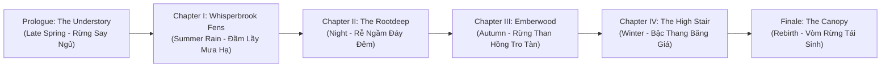

# PHÂN TÍCH CHUYÊN SÂU GAME "UNDERSTORY" & BÀI HỌC THIẾT KẾ CHO GAME THÁNH GIÓNG
> **Nguồn phân tích:** [Understory (Vercel Live)](https://understory-gamma-silk.vercel.app/?chapter=fens&checkpoint=start)  
> **Phiên bản khảo sát:** Chapter I — Whisperbrook Fens (Checkpoint: Start)  
> **Người thực hiện:** Antigravity AI — Dự Án Game Thánh Gióng  
> **Ngày lập:** 02/10/2026  

---

## MỤC LỤC
1. [Bước 1: Phong Cách Nghệ Thuật & Level Design (Cảm Hứng Cho Map Rừng & Đầm Lầy Thánh Gióng)](#bước-1-phong-cách-nghệ-thuật--level-design)
2. [Bước 2: Phân Tích Mã Nguồn, Cơ Chế Điều Khiển & Camera Engine](#bước-2-phân-tích-mã-nguồn-cơ-chế-điều-khiển--camera-engine)
3. [Bước 3: Trích Xuất Toàn Bộ Cốt Truyện, 6 Chương & Hệ Thống Dữ Liệu](#bước-3-trích-xuất-toàn-bộ-cốt-truyện-6-chương--hệ-thống-dữ-liệu)
4. [Bước 4: Ứng Dụng Chuyển Giao Công Nghệ Vào Unity Cho Game Thánh Gióng](#bước-4-ứng-dụng-chuyển-giao-công-nghệ-vào-unity-cho-game-thánh-gióng)

---

## BƯỚC 1: PHONG CÁCH NGHỆ THUẬT & LEVEL DESIGN

### 1.1. Triết Lý Nghệ Thuật "Living Painted Forest" (Khu Rừng Hội Họa Sống)
Game *Understory* không sử dụng kết cấu 3D chân thực (photorealistic) thông thường mà áp dụng phong cách **Tranh vẽ tay / Thủy mặc phương Đông kết hợp tranh minh họa cổ điển**:
- **Bảng Màu Cốt Lõi (Trích xuất từ mã nguồn `rs` palette):**
  - **Màu Mực Viền (`ink`):** `#15201c` — Đường nét vẽ tay màu mực đen pha ánh lục sẫm, không dùng màu đen thuần `#000000` để tránh gắt mắt.
  - **Chất Nền Giấy Dó (`paper`):** `#efe9d6` — Màu nền ngả vàng nhạt ấm áp, tạo cảm giác như toàn bộ thế giới được vẽ trên một cuộn giấy cổ truyền.
  - **Hệ Thảo Mộc Rừng Sâu:** 
    - `leafDeep`: `#142824` | `leafShadow`: `#223f37` | `leaf`: `#36604a`
    - `moss` (Rêu): `#6a8c4a` | `mossLight`: `#a6c46a`
    - `grass` (Cỏ non): `#5e8a4e` | `grassDry` (Cỏ úa): `#9aa565`
  - **Môi Trường Nước & Sương Khói Đầm Lầy (Fens):**
    - `water`: `#3b6a72` (Xanh rêu đầm lầy) | `waterLight`: `#8fc2bd` | `foam`: `#e4f1e6`
    - `mist` (Khói sương): `#b9d3c7` | `fogColor`: `#9fbfb4` | `shadowCool`: `#1e333a`
  - **Điểm Nhấn Nhân Vật (Hero Contrast Accent):**
    - `scarf`: `#e5452c` (Khăn quàng đỏ rực) | `scarfDark`: `#a82a1e`
    - Chiếc khăn đỏ là tâm điểm thị giác tuyệt đối, giúp người chơi luôn định vị được nhân vật chính giữa đại ngàn xanh biếc.
  - **Yếu Tố Thần Thoại & Ô Uế (Blight & Light):**
    - `light`: `#ffd27a` (Ánh sáng thần kỳ Lumen) | `blight`: `#2a2433` (Tà khí tím sẫm) | `threat`: `#bff4ff`

### 1.2. Thuật Toán Tạo Nét Vẽ Tay Độc Quyền (Organic Stroke Rendering)
Từ mã nguồn JS bundle, nhà phát triển không nạp texture vẽ sẵn mà sinh trực tiếp bằng toán học:
1. **Thuật toán Chaikin Subdivision (`gx`):** Làm mịn các đường gấp khúc đa giác thành đường cong mềm mại tự nhiên theo tỷ lệ trọng số `0.75 : 0.25`.
2. **Thuật toán Rung Bút Tay Người (`xu` - Wobble Noise):**
   ```javascript
   d = (Math.sin(seed * 13.7 + length * freq) * 0.75 + Math.sin(seed * 5.1 + length * freq * 3.1) * 0.25) * amount;
   ```
   Tạo độ gồ ghề ngẫu nhiên của ngòi cọ vẽ tay, loại bỏ hoàn toàn cảm giác đa giác máy móc (computer-generated look).
3. **Mô Phỏng Độ Đậm Nhạt Cọ Vẽ (`It` - Variable Ink Pressure):** Tự động vuốt nhọn ở hai đầu (`taper`) và phình rộng ở giữa theo lực nhấn giả lập.

### 1.3. Cấu Trúc Level Design Chương I: "Whisperbrook Fens"
Chương Fens (Đầm lầy mưa hạ) được thiết kế theo cấu trúc **"Tuyến tính linh hoạt xen kẽ Đấu trường mở"**:
```
[Start Checkpoint] 
       │
       ▼ (Lối mòn hẹp ven đầm lầy)
[Boardwalks - Cầu Ván Gỗ] ─── (Vượt dòng nước xiết `currents`)
       │
       ▼
[Ngôi Làng Ngập Nước - Village] ─── (Gặp dân làng, nhặt mầm hoa súng `lily`)
       │
       ▼
[Vùng Trũng Âm U - The Hollow] ─── (Quái vật ngầm `lurkers` rình rập)
       │
       ▼
[Cổng Đèn Lồng - Lantern Gate] ─── (Giải đố chiếu sáng Lumen)
       │
       ▼
[Mỏm Quan Sát - Vista Point] ─── (Camera tự động mở rộng bao quát toàn cảnh)
       │
       ▼
[Đấu Trường Boss - The Arena] ─── (Chiến đấu cao trào, thanh lọc đất đai `healed`)
```

---

## BƯỚC 2: PHÂN TÍCH MÃ NGUỒN, CƠ CHẾ ĐIỀU KHIỂN & CAMERA ENGINE

### 2.1. Kiến Trúc Camera Rig Cao Cấp (`class j0`)
Camera trong game là một tuyệt phẩm kỹ thuật camera đẳng giác (Isometric Hybrid), gồm các thông số chuẩn xác được trích xuất:
- **Góc đặt Camera:** 
  - `pitch = 52°` (`ar.pitch = degToRad(52)`): Góc nghiêng 52 độ từ trên cao nhìn chéo xuống.
  - `FOV = 30°`: Trường nhìn hẹp tạo phối cảnh nén sâu (telephoto compression), giữ cho các vật thể 3D trông phẳng và nghệ thuật như tranh lụa.
- **Hệ Thống 6 Ống Kính Điện Ảnh (Cinematic Presets `Sa`):**
  ```javascript
  const Sa = {
    title:   { distance: 250, offsetX: 0, offsetZ: -14, lookAhead: 0 },
    explore: { distance: 96,  offsetX: 0, offsetZ: -2,  lookAhead: 5 },
    combat:  { distance: 74,  offsetX: 0, offsetZ: -1,  lookAhead: 2 },
    vista:   { distance: 230, offsetX: 0, offsetZ: -20, lookAhead: 0 },
    boss:    { distance: 118, offsetX: 0, offsetZ: -6,  lookAhead: 0 },
    close:   { distance: 38,  offsetX: 0, offsetZ: 0,   lookAhead: 0 }
  };
  ```
- **Cơ Chế Look-Ahead (Đón đầu chuyển động):**
  - Camera không khóa cứng vào người chơi mà tính toán độ dịch chuyển phía trước:
    ```javascript
    const leadX = target.dir.x * shot.lookAhead * (target.speed / 4);
    const leadZ = target.dir.z * shot.lookAhead * (target.speed / 4);
    ```
    Khi người chơi chạy nhanh về phía trước, tầm nhìn tự động mở rộng theo hướng đó.
- **Rung Lắc Vật Lý (Trauma-based Screen Shake):**
  - Sử dụng mô hình `Trauma` (chấn động):
    ```javascript
    trauma = clamp(trauma + amount, 0, 1);
    shakeIntensity = trauma * trauma * distance * 0.012;
    ```
    Bình phương `trauma^2` giúp rung động nhỏ thì êm ái, nhưng đòn đánh cực đại sẽ tạo chấn động rung giật mãnh liệt.
- **Hệ Thống Focus Kép (Dual Focus Framing):**
  - Khi đối đầu với Boss hoặc đứng trước Landmark, camera tính toán nội suy mượt mà vị trí trung bình giữa Player và mục tiêu với trọng số `weight = 0.5`.

### 2.2. Bản Đồ Phím & Cơ Chế Điều Khiển Toàn Diện
Game hỗ trợ song song Bàn phím (Keyboard), Tay cầm (Gamepad) và Cảm ứng (Touch):
| Thao Tác | Bàn Phím (PC) | Tay Cầm (Gamepad) | Mô Tả Hành Động |
| :--- | :--- | :--- | :--- |
| **Di Chuyển** | `WASD` / Mũi tên | D-Pad / Cần Analog Trái | Di chuyển 8 hướng mượt mà với quán tính |
| **Tấn Công (Attack)** | Phím `J` hoặc `X` | Nút `X` (PlayStation) / `A` (Xbox) | Vung vũ khí cận chiến, tạo vệt cọ sáng chém địch |
| **Né Đòn / Lướt (Dodge)** | `Space` / `K` / `C` / `Shift` | Nút `Square` / `B` | Lướt nhanh né tránh đòn đánh, kháng sát thương |
| **Gieo Mầm (Plant)** | Phím `L` hoặc `Q` | Nút `Triangle` / `Y` | Thả hạt mầm ánh sáng (Lumen/Lily) thanh tẩy đất |
| **Tương Tác (Interact)** | Phím `E` | Nút ngữ cảnh | Nói chuyện, kích hoạt cổng đèn lồng, nhổ vật phẩm |
| **Chọn Hạt Giống (Seeds)** | `1..5` hoặc `Tab` | Cò vai `L1` / `R1` | Chuyển đổi giữa các loại mầm thần kỳ |
| **Tạm Dừng (Pause)** | `Escape` hoặc `P` | `Start` / `Select` | Mở menu cài đặt âm thanh, đồ họa |

---

## BƯỚC 3: TRÍCH XUẤT TOÀN BỘ CỐT TRUYỆN, 6 CHƯƠNG & HỆ THỐNG DỮ LIỆU

### 3.1. Danh Sách 6 Chương Trọn Vẹn Của "Understory"
Mã nguồn tiết lộ toàn bộ cấu trúc 6 màn chơi theo dòng thời gian 4 mùa luân chuyển:



1. **Prologue: The Understory**
   - *Mùa:* Late Spring (Cuối xuân) | *Biome:* Understory (Tầng dưới tán rừng)
   - *Checkpoints:* `start`, `stream` (Whisperbrook), `lumen`, `glade`, `vista`, `arena`.
   - *Ý nghĩa:* Nơi nhân vật chính thức tỉnh trong khu rừng cổ thụ ngái ngủ, học cách gieo hạt mầm ánh sáng Lumen đầu tiên.
2. **Chapter I: Whisperbrook Fens** (Chương người dùng gửi liên kết)
   - *Mùa:* Summer Rain (Mưa rào mùa hạ) | *Biome:* Fens (Vùng đầm lầy trũng)
   - *Hạt giống độc quyền:* `Lily` (Mầm hoa súng nở ra bệ đỡ trên mặt nước đầm lầy).
   - *Hiện tượng môi trường:* Mưa rơi rả rích, sương mờ dâng cao, dòng nước xiết cuốn trôi lữ khách.
3. **Chapter II: The Rootdeep**
   - *Mùa:* Night (Màn đêm vĩnh cửu) | *Biome:* Rootdeep (Mê cung rễ cây ngầm)
   - *Ý nghĩa:* Dấn thân vào lòng đất tối tăm, rễ cổ thụ khổng lồ, chiến đấu với quái vật vực thẳm.
4. **Chapter III: Emberwood**
   - *Mùa:* Autumn (Mùa thu đỏ lửa) | *Biome:* Emberwood (Rừng tàn tích than hồng)
   - *Ý nghĩa:* Vùng đất rừng bị thiêu rụi, tro tàn bay trong gió, biểu tượng của sự hủy diệt và tàn khốc.
5. **Chapter IV: The High Stair**
   - *Mùa:* Winter (Mùa đông tuyết giá) | *Biome:* Highstair (Bậc thang vách núi đá)
   - *Ý nghĩa:* Con đường leo dốc đứng vượt qua bão tuyết và băng giá để đến đền thờ ngọn núi thiêng.
6. **Finale: The Canopy**
   - *Mùa:* Rebirth (Tái sinh bừng sáng) | *Biome:* Canopy (Vòm trời trên ngọn đại ngàn)
   - *Ý nghĩa:* Đứng trên biển mây bao la, ánh sáng rực rỡ, hoàn tất hành trình hóa thánh bất tử.

### 3.2. Âm Thanh Tổng Hợp Thời Gian Thực (Tone.js Procedural Audio)
Game không tốn băng thông tải các bản thu MP3/WAV mà dùng Web Audio API để phát sinh:
- **Tiếng bước chân thích ứng (`step`):** Tự động đổi âm sắc tùy thuộc bề mặt nhân vật đang giẫm lên:
  - Trên ván gỗ (`boardwalk`): Âm thanh cộc cộc vang ấm.
  - Trên cỏ mềm (`grass`): Tiếng xào xạc nhẹ tênh.
  - Dưới nước cạn (`water`): Tiếng bì bõm ướt át.
- **Tiếng đầm lầy u tịch:** Hợp âm rền nền (ambient drone) ngũ cung kết hợp tiếng giọt nước thánh thót rơi ngắt quãng.

---

## BƯỚC 4: ỨNG DỤNG CHUYỂN GIAO CÔNG NGHỆ VÀO UNITY CHO GAME THÁNH GIÓNG

Hành trình từ **Whisperbrook Fens -> The Rootdeep -> Emberwood -> The High Stair -> The Canopy** có sự tương đồng đáng kinh ngạc với **Huyền tích Thánh Gióng**:

| Yếu Tố Của "Understory" | Áp Dụng Trực Tiếp Vào Game Thánh Gióng |
| :--- | :--- |
| **Chương I (Whisperbrook Fens) — Đầm lầy mưa hạ** | **Màn 1: Làng Phù Đổng & Vùng Đầm Dạ Trạch:** Cầu ván gỗ bắc qua ao chuôm, khóm tre ngà soi bóng mặt nước, lau sậy đầm lầy. |
| **Chương III (Emberwood) — Lửa than hồng** | **Màn 2: Lò Rèn Triều Đình & Ngựa Sắt Phun Lửa:** Tro than đỏ rực, sắt thép tôi luyện, Hỏa Tuyến quét sạch chướng ngại vật. |
| **Chương II & IV (The Rootdeep / Highstair)** | **Màn 3: Trận Tuyến Núi Sóc:** Rừng cây khô cháy sém, đá nhọn đâm tua tủa, chiến trường hoang tàn bi tráng. |
| **Finale (The Canopy) — Vòm trời tái sinh** | **Màn 4: Đỉnh Sóc Hóa Thánh:** Biển mây bồng bềnh, cởi giáp vàng, cưỡi ngựa sắt bay vút lên trời xanh bất tử. |

### 4.1. Bộ Thông Số Camera Chuẩn Cho Game Thánh Gióng (Học Từ `class j0`)
Trong script [`IsometricCameraFollow.cs`](file:///e:/Game/Game_thanhgiong/Assets/Code/Scripts/IsometricCameraFollow.cs):
- **Góc nghiêng (Pitch):** Cài đặt `52°` (thay vì 45° thông thường) giúp nhìn rõ tầm xa hơn, tạo chiều sâu thị giác.
- **Độ mở ống kính (FOV):** Điều chỉnh về `32° - 35°` (URP Camera) để triệt tiêu độ méo góc rộng, tôn dáng Ngựa Sắt dũng mãnh.
- **Lead Offset (Đón đầu):** Thêm độ trễ đón đầu theo vận tốc phi ngựa:
  ```csharp
  Vector3 lead = playerRigidbody.velocity.normalized * 3.5f;
  targetPosition = player.position + offset + lead;
  ```
- **Trauma Screen Shake:** Khi Gióng quét Tre Ngà 360 độ hoặc ngựa phun Hỏa Tuyến, kích hoạt hàm rung chấn bình phương:
  ```csharp
  float shake = trauma * trauma * 0.45f;
  ```

### 4.2. Cấu Trúc Bổ Sung Cho Map Đầm Lầy (Fens) Trong KayKit Nature
Kết hợp bộ asset `KayKit - Forest Nature Pack` hiện có trong project để xây dựng phân khu đầm lầy:
1. **Lối Đi Cầu Gỗ (Boardwalks):** Dùng các thanh gỗ `Plank` và `Wooden Bridge` uốn lượn ngoằn ngoèo trên mặt hồ Nguyệt Đãng.
2. **Cụm Thực Vật Đầm Lầy:** Đặt xen kẽ `Grass_1_C_Singlesided`, `Grass_2_D` (lau sậy ngập nước) và hoa sen/súng dọc mép nước.
3. **Hiệu Ứng Sương Mù Đầm Lầy (Swamp Mist):** 
   - Điều chỉnh URP Fog Color: `#9FBFB4` (Xanh ngọc khói).
   - Tầng sương là là mặt hồ bằng các Quad hạt trong suốt lăn tăn trên mặt nước.

---
*Tài liệu này được biên soạn độc quyền cho quá trình phát triển Game Thánh Gióng 3D URP.*
