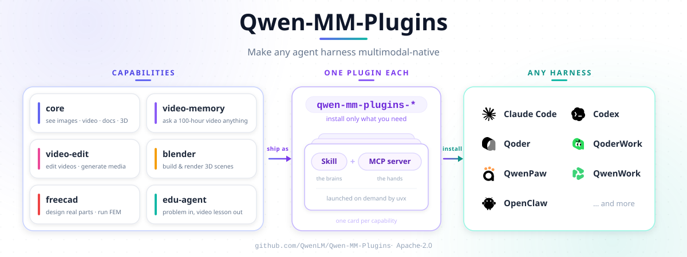

# Qwen-MM-Plugins

[English](README.md) · **中文**

面向 Qwen 模型的原生多模态理解插件，让任何 Agent Harness 都具备原生多模态能力。

按能力查找插件，预览 Skill 和工具定义，并在 Cookbook 中直接查看示例视频和交互案例。
Hub 同时收录英文文档；中文文档继续在本仓库维护。

<p align="center">
  <a href="https://qwenlm.github.io/qwen-mm-plugins-hub/"></a>
  <a href="https://github.com/QwenLM/Qwen-MM-Plugins/issues/72"></a>
  <a href="https://join.slack.com/t/qwen-mm-plugins/shared_invite/zt-475c57729-K2rpYeb6EJKNJUd5Zun5Cg"></a>
</p>

## 📰 最新动态

- **2026-09-22**： 💬 新增[**微信交流群**](https://github.com/QwenLM/Qwen-MM-Plugins/issues/72)和 [**Slack 社区**](https://join.slack.com/t/qwen-mm-plugins/shared_invite/zt-475c57729-K2rpYeb6EJKNJUd5Zun5Cg)入口，欢迎交流使用体验、分享作品和讨论新功能。
- **2026-09-20**： 🚀 新增 [**MHS**](https://qwenlm.github.io/qwen-mm-plugins-hub/plugins/mhs/cookbook/) 和 [**video-spatio**](https://qwenlm.github.io/qwen-mm-plugins-hub/plugins/video-spatio/cookbook/)，分别支持操作真实硬件，以及图片和视频的 3D 空间推理。
- **2026-09-16**： 🛠️ 新增 [**omni-skill-creator**](https://qwenlm.github.io/qwen-mm-plugins-hub/plugins/omni-skill-creator/cookbook/)，将演示视频转化为可复用的 Agent Skill。

<details>
<summary><b>历史动态</b></summary>

- **2026-09-10**： 🎬 新增 [**omni-chatcut**](https://qwenlm.github.io/qwen-mm-plugins-hub/plugins/omni-chatcut/cookbook/)，支持音乐生成 MV、电影解说和视频翻译；新增 [**omni-video2note**](https://qwenlm.github.io/qwen-mm-plugins-hub/plugins/omni-video2note/cookbook/)，将教程视频转化为图文 PDF。
- **2026-09-10**： 🌐 新增 [**Plugin Hub**](https://qwenlm.github.io/qwen-mm-plugins-hub/)，集中浏览插件、文档，以及带视频和交互演示的 Cookbook 案例。
- **2026-09-03**： 🧠 新增 [**omni-memory**](https://qwenlm.github.io/qwen-mm-plugins-hub/plugins/omni-memory/cookbook/)，为长视频构建和查询音视频记忆，涵盖说话人、对话、声音与事件。
- **2026-08-11**： 🧩 推出独立的 [**api**](https://qwenlm.github.io/qwen-mm-plugins-hub/plugins/api/cookbook/) 和 [**search**](https://qwenlm.github.io/qwen-mm-plugins-hub/plugins/search/cookbook/) 插件，将 Qwen VL/Omni 模型服务与网页搜索从本地多模态工具中拆分出来。
- **2026-08-03**： 🎉 首次发布！[**core**](https://qwenlm.github.io/qwen-mm-plugins-hub/plugins/core/cookbook/) 支持原生读取图片、视频、文档和 3D 文件；[**video-memory**](https://qwenlm.github.io/qwen-mm-plugins-hub/plugins/video-memory/cookbook/) 支持长视频问答；[**video-edit**](https://qwenlm.github.io/qwen-mm-plugins-hub/plugins/video-edit/cookbook/) 支持媒体生成与剪辑；[**Blender**](https://qwenlm.github.io/qwen-mm-plugins-hub/plugins/blender/cookbook/) 和 [**FreeCAD**](https://qwenlm.github.io/qwen-mm-plugins-hub/plugins/freecad/cookbook/) 支持 3D 建模与参数化 CAD；[**edu-agent**](https://qwenlm.github.io/qwen-mm-plugins-hub/plugins/edu-agent/cookbook/) 支持教学视频与交互讲解。

</details>

## 架构



## 安装

### 让 Agent 安装

直接告诉 Agent（将 `core` 和 `api` 替换为你需要的插件）：

```text
请参考 https://raw.githubusercontent.com/QwenLM/Qwen-MM-Plugins/main/docs/zh/installation.md 安装 core 和 api 插件。
```

### 自己安装

引导式安装器支持 Claude Code、CodeBuddy、Codex、Qoder、OpenClaw、Qwen Code 和 Gemini CLI。
共享配置位于 `~/.qwen-mm-plugins/config`。

WorkBuddy、QoderWork 与 QwenWork 的应用内安装，以及 DeepSeek Harness、Hermes Agent、
opencode、pi 和 QwenPaw 的手动安装方式见[其他 Harness 安装](docs/zh/manual_harnesses.md)。

```bash
curl -fsSL https://raw.githubusercontent.com/QwenLM/Qwen-MM-Plugins/main/install.sh | bash
```

更新某个 harness 中已安装的能力：

```bash
curl -fsSL https://raw.githubusercontent.com/QwenLM/Qwen-MM-Plugins/main/install.sh | bash -s -- update
```

正式能力使用彼此独立且不可变的发布 tag。本地 checkout、版本回退、手动 skill + MCP 安装、
依赖以及 Windows/WSL2 说明见[安装文档](docs/zh/installation.md)。

## 能力

每个能力独立安装，由一个 **Skill** 和可选的 **MCP server** 组成，安装名为
`qwen-mm-plugins-<capability>`。按你 agent 的主模型来选。多模态模型强烈建议使用 `core`：
它让主模型原生读取图片、视频和文件，而不是绕到另一个 API、或拼一堆临时的 shell 命令去处理。

**通用**：

| 能力 | 用途 | Cookbook |
|---|---|---|
| `core` | 读取本地图片和视频帧，可视化文档、代码、数据、3D 模型，供 agent 查看。提供媒体元数据、裁图、边框标注及页面/视频帧导出。默认原生模式无需 API key。 | [Cookbook](https://qwenlm.github.io/qwen-mm-plugins-hub/plugins/core/cookbook/) |
| `nifti` | 查看 NIfTI 文件头信息并渲染切片，支持自定义源体素轴切片、体级强度归一化、显式窗预设及实际配置回显。 | [Cookbook](https://qwenlm.github.io/qwen-mm-plugins-hub/plugins/nifti/cookbook/) |
| `api` | 调用模型服务理解图片、视频和音频：VL 视觉问答/OCR/目标定位，Omni 转写/说话人区分/内容描述/事件分析，以及专用 ASR 和 SAM3 分割。按模型类别配置 DashScope 或兼容的自托管服务；使用 DashScope 时，超过 base64 限额的本地音视频可自动上传到模型绑定的临时 OSS。 | [Cookbook](https://qwenlm.github.io/qwen-mm-plugins-hub/plugins/api/cookbook/) |
| `search` | 面向任意模型。网页搜索和页面抽取支持 Serper、Exa、Tavily 或 Serply；反向图像搜索使用 Serper。 | [Cookbook](https://qwenlm.github.io/qwen-mm-plugins-hub/plugins/search/cookbook/) |
| `mhs` | 面向任意模型。通过 Model Hardware Standard adapter 操作真实硬件——摄像头、传感器、灯、机械臂、实验设备；主机侧强制执行安全限位，并提供紧急停止。adapter 由硬件方自己运行，不需要云端 key。 | [Cookbook](https://qwenlm.github.io/qwen-mm-plugins-hub/plugins/mhs/cookbook/) |

**Qwen VL 系列模型**（例如 **Qwen3.8-Max**、**Qwen3.7-Plus**）：

| 能力 | 用途 | Cookbook |
|---|---|---|
| `video-memory` | 为长视频构建层次化记忆，之后的提问直接从记忆里回答，不必重看视频。需要 DashScope key 和 ffmpeg。 | [Cookbook](https://qwenlm.github.io/qwen-mm-plugins-hub/plugins/video-memory/cookbook/) |
| `video-edit` | 生成图片、视频和音频，并在其上运行剪辑工作流。需要 DashScope key、ffmpeg 和 Node。 | [Cookbook](https://qwenlm.github.io/qwen-mm-plugins-hub/plugins/video-edit/cookbook/) |
| `video-spatio` | 回答图片和视频里的 3D 问题——距离、尺寸、朝向、左右前后、相机运动、3D 计数。感知由模型自己完成，无状态几何工具负责算数。几何工具不需要 API key。 | [Cookbook](https://qwenlm.github.io/qwen-mm-plugins-hub/plugins/video-spatio/cookbook/) |
| `blender` | 驱动一个正在运行的 Blender：建模、材质、灯光与渲染。需要已安装 Blender。 | [Cookbook](https://qwenlm.github.io/qwen-mm-plugins-hub/plugins/blender/cookbook/) |
| `freecad` | 驱动一个正在运行的 FreeCAD：参数化 CAD、STEP/STL 与 FEM。需要已安装 FreeCAD。 | [Cookbook](https://qwenlm.github.io/qwen-mm-plugins-hub/plugins/freecad/cookbook/) |
| `edu-agent` | 生成中文数理讲解视频与交互页面。纯 Skill，需要 Node 和 ffmpeg。 | [Cookbook](https://qwenlm.github.io/qwen-mm-plugins-hub/plugins/edu-agent/cookbook/) |

**Qwen Omni 系列模型**（例如 **qwen3.8-omni-flash**）：

> 目前大多数 harness 还不支持把音频原生输入给主模型，因此音频暂时通过 API 处理。

| 能力 | 用途 | Cookbook |
|---|---|---|
| `omni-chatcut` | 视频创作 Skill 集合，支持音乐生成 MV、电影解说和保留说话人音色的视频翻译。需要相应的生成/Omni 服务、ffmpeg/ffprobe；翻译配音还需可选的外部配音服务。 | [Cookbook](https://qwenlm.github.io/qwen-mm-plugins-hub/plugins/omni-chatcut/cookbook/) |
| `omni-video2note` | 通过 Omni 音视频理解将本地教程视频转换为图文 PDF，并返回审阅反馈。需要 DashScope key 和 ffmpeg。 | [Cookbook](https://qwenlm.github.io/qwen-mm-plugins-hub/plugins/omni-video2note/cookbook/) |
| `omni-skill-creator` | 将演示视频转化为可复用的 Agent Skill。需要 DashScope key 和 ffmpeg。 | [Cookbook](https://qwenlm.github.io/qwen-mm-plugins-hub/plugins/omni-skill-creator/cookbook/) |
| `omni-memory` | 为长音视频构建音视频记忆：谁在场、谁说了什么、怎么说的、听起来是什么样。由 Omni 模型连同音轨一起读取视频。需要 DashScope key 和 ffmpeg。 | [Cookbook](https://qwenlm.github.io/qwen-mm-plugins-hub/plugins/omni-memory/cookbook/) |

具体版本与可选依赖见[安装文档](docs/zh/installation.md#依赖)。

## 快速体验

安装能力后，引用文件并直接提问即可；Skill 会选择对应的 MCP 工具。

```text
@report.pdf          总结第 3 页，并提取其中的表格。
@meeting.mp4         带说话人标签和时间戳转写这段会议。
@place.jpg           判断照片拍摄地点，并联网核实。
@lecture-2h.mp4      按时间戳列出这段长视频的主要观点。
@tutorial.mp4        生成图文 PDF 到 /absolute/path/tutorial-notes.pdf。
```

`core` 会以动态分辨率读取媒体，通常无需手动缩放。

需要读取 NIfTI 文件头信息时，使用独立 `nifti` 插件的 `nifti_inspect` 工具；需要自定义切片显示时，直接使用 `nifti_render_slices`，不必先检查文件头：
默认沿源体素轴 2 选取三张内部切片，共用该体数据的 P1–P99 强度范围。
首次发布前，可按[本地开发文档](docs/zh/local_development.md#快速源码循环)从源码试用 `nifti`。

## 依赖与配置

- [`uv`](https://docs.astral.sh/uv/) 提供 `uvx`，按需安装 Python 依赖。
- 本地 `core` 工具在默认原生图片模式下无需 API key；纯文本图片描述 fallback、云端和搜索能力
  需要对应服务的凭证。
- 视频、文档、浏览器、Blender 和 FreeCAD 工作流可能需要系统程序。

通过安装器的 **Configure** 和 **Verify** 操作设置凭证并检查依赖。系统要求见
[安装文档](docs/zh/installation.md#依赖)，全部设置见[配置参考（英文）](docs/en/configuration.md)。

## 文档

- [安装](docs/zh/installation.md)
- [配置参考（英文）](docs/en/configuration.md)
- [贡献指南](CONTRIBUTING.md) · [本地开发](docs/zh/local_development.md)
- [添加新插件](docs/zh/how_to_add_new_capability.md) · [Hub 维护](docs/zh/hub.md) · [测试](docs/zh/testing.md)

## 社区

欢迎在 [Slack](https://join.slack.com/t/qwen-mm-plugins/shared_invite/zt-475c57729-K2rpYeb6EJKNJUd5Zun5Cg) 或[微信交流群](https://github.com/QwenLM/Qwen-MM-Plugins/issues/72)中交流使用经验、分享作品、讨论新功能。
Bug 报告和功能请求请提交到 [GitHub Issues](https://github.com/QwenLM/Qwen-MM-Plugins/issues)，方便跟进。

## 引用

如果本项目对你的研究或工作有帮助，欢迎引用：

```bibtex
@misc{qwen_mm_plugins2026,
  title  = {Qwen-MM-Plugins: Native Multimodal Plugins for Qwen Models},
  author = {{Qwen Team}},
  year   = {2026},
  url    = {https://github.com/QwenLM/Qwen-MM-Plugins}
}
```

## 许可证

Apache-2.0，见 [LICENSE](LICENSE)。Blender 与 FreeCAD 集成的第三方署名分别见
[Blender NOTICE](src/capabilities/blender/NOTICE.md) 和 [FreeCAD NOTICE](src/capabilities/freecad/NOTICE.md)。
